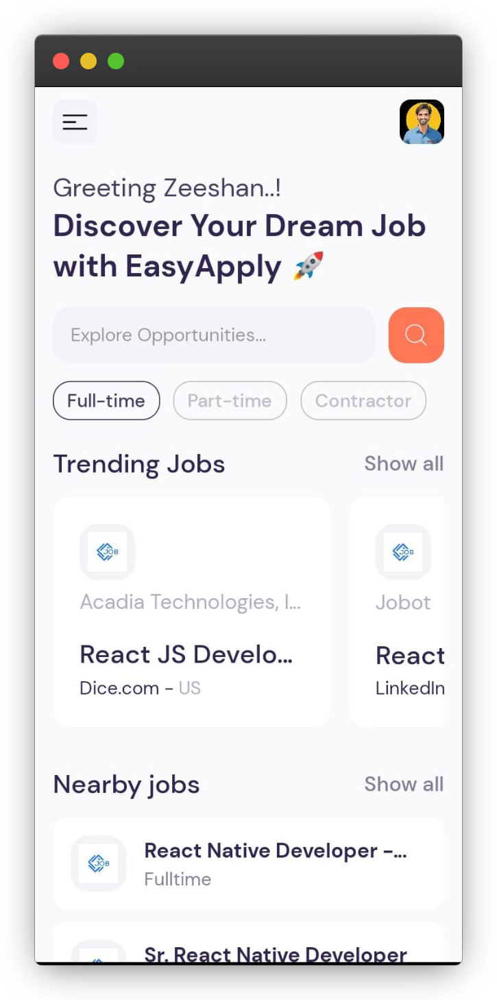
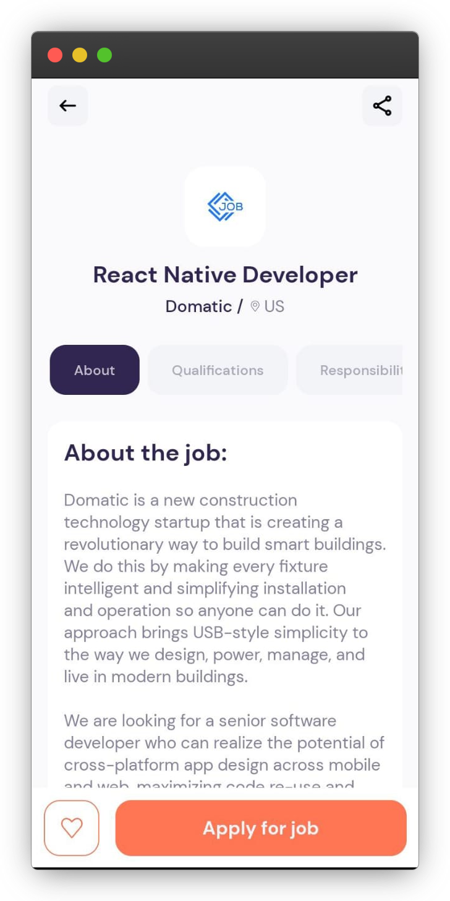
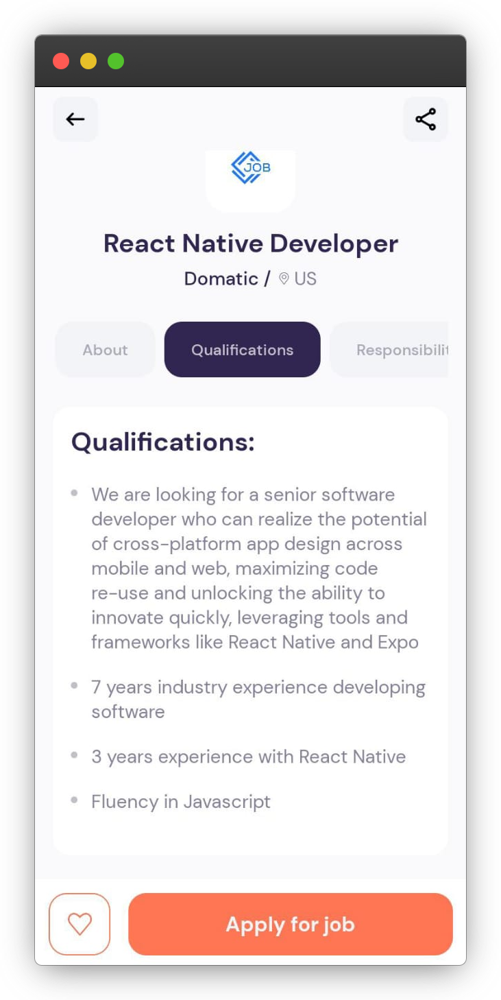
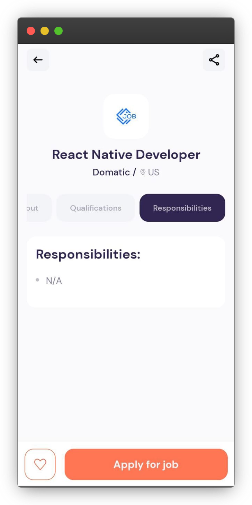
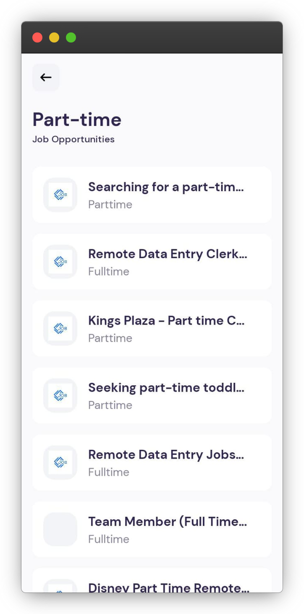

# Easy Apply - React Native Job Hunter App

  

<h2 align="center">Welcome to Easy Apply!</h2>

Your go-to mobile application for seamless job hunting using React Native. Let's explore the world of opportunities together! 🚀

## Project Screenshots

<table>
  <tr>
    <td align="center">
      
    </td>
    <td align="center">
      
    </td>
  </tr>
  <tr>
    <td align="center">
      
    </td>
    <td align="center">
      
    </td>
  </tr>
  <tr>
    <td align="center">
      
    </td>
    <td align="center">
    </td>
  </tr>
</table>

## 🧐 Features

Here are some of the stellar features that make Easy Apply shine:

- **User-friendly Interface**: Enjoy a visually appealing and intuitive design.
- **API Integration**: Seamlessly fetch job data from the [JSearch API](https://rapidapi.com/letscrape-6bRBa3QguO5/api/jsearch).
- **Search Functionality**: Dive deep into opportunities with advanced search features.
- **Pagination**: Effortlessly browse through job listings with convenient pagination.
- **Custom Hooks**: Optimize your code structure with custom API data fetching hooks.

## 🍰 Contribution Guidelines

Excited to contribute? Fantastic! Whether it's enhancing features, requesting new ones, or fixing bugs, your contributions are invaluable. Open an issue or submit a pull request – we're all ears.

## 💻 Built with

Technologies that power Easy Apply:

- **Javascript**
- **React Native**
- **Expo Router**

## 🚀 Demo

[Explore the Demo APK](https://github.com/ZeeshanMukhtar1/EasyApply/releases)

Let the job hunt begin! 🌟🔍
Happy Coding! 🚀
